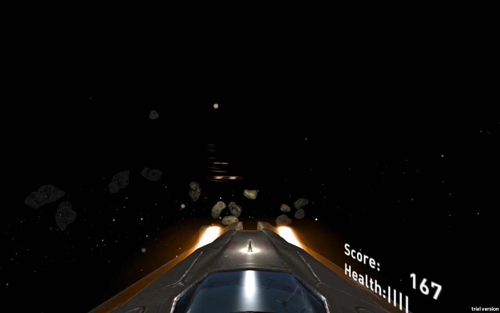

# AsterRift

Asteroid space shooting game made in Unity3d for Oculus Rift and Leap Motion. This was the winning entry for the first StacsHack Hackathon at St Andrews in 2015.

Tilt your hand over the leap motion to move the ship and fire by clenching your fist with your other hand or by pressing `spacebar`. Destroy the incoming asteroids, but don't get hit!

## Downloads:

- Oculus Rift version (macOS): [AsterRift](AsterRift.zip)
- Screen version (macOS): [AsterRiftNoRift](AsterRiftNoRift.zip)

## License

Copyright 2017 Billy Brown, Danielle Jukes, Kieran Kelk, Luke Bissell.

This project (AsterRift) is licensed under the MIT License. See LICENSE.
